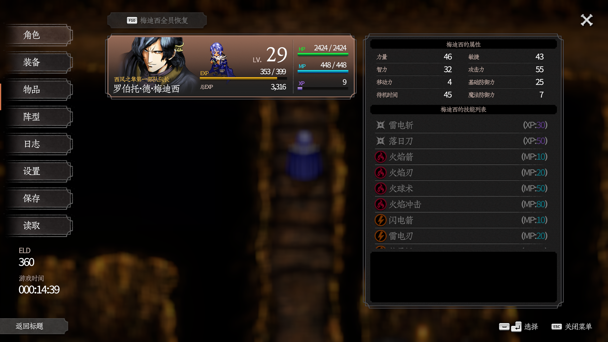
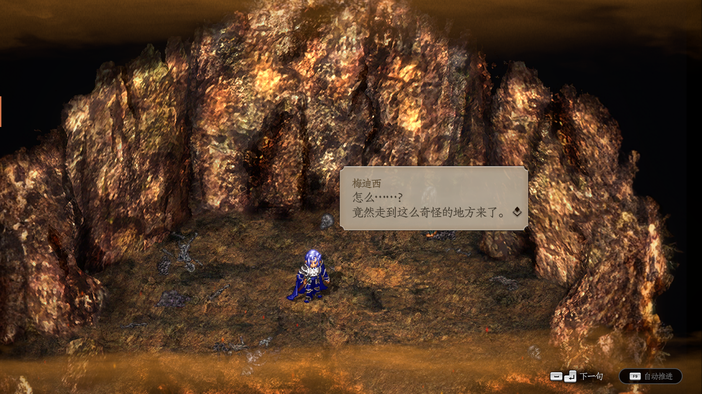
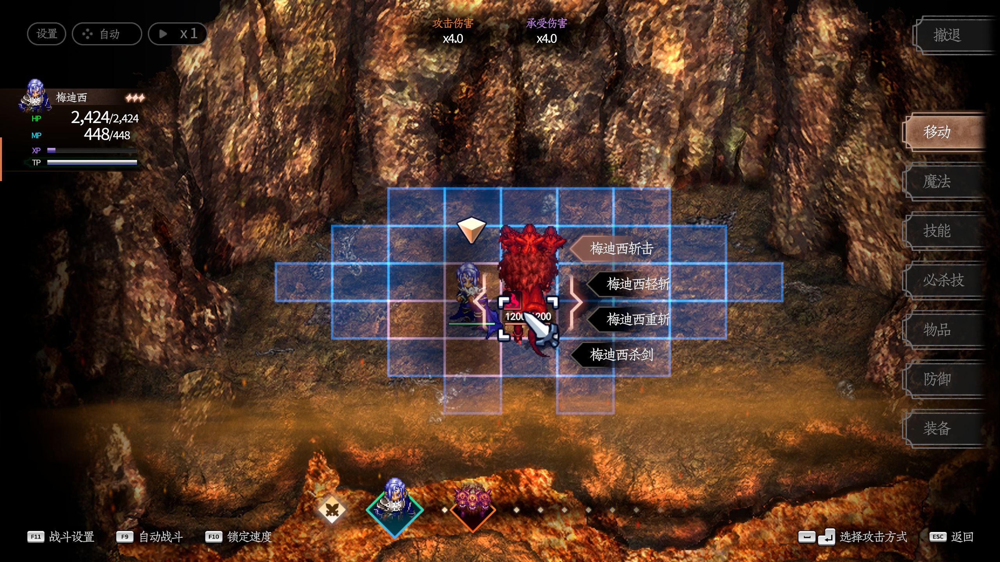
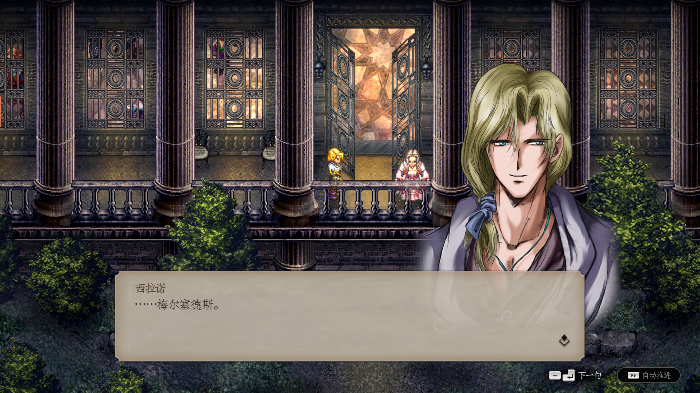
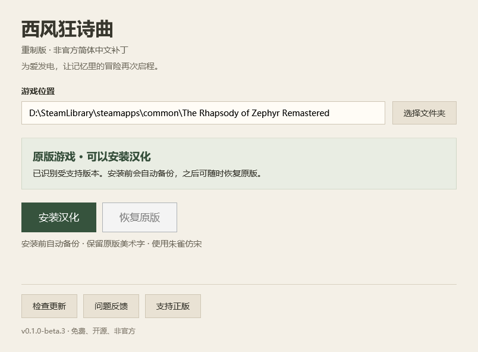

# 西风狂诗曲
### 重制版 · 简体中文重译计划

**让记忆里的冒险再次启程。**

为爱发电的非官方汉化 · 朱雀仿宋 · 保留原作美术字

[**下载汉化工具**](https://github.com/wanjizheng/zephyr-remastered-zh-cn/releases)　｜　[人物译名对照](#人物译名对照)　｜　[反馈问题](https://github.com/wanjizheng/zephyr-remastered-zh-cn/issues)　｜　[支持正版](https://store.steampowered.com/app/5099430/)

---

## 写在前面

小时候，我特别喜欢《西风狂诗曲》。1998 年的原作，以及后来陪伴我们的老中文版，留下了很多难忘的回忆。如今重制版来了，我想再走一遍那段旅程，也希望更多中文玩家能读懂这个故事，于是有了这个免费的汉化项目。

但对旧中文版的部分译名和对白，我一直有些遗憾：有些人名拗口，同一个人物在不同资料中有不同叫法，一些剧情表达也读得不够顺畅。**这次我以重制版韩文资源为基础重新翻译，优化对白和术语，并对部分人物姓名重新定译。** 熟悉的故事还在，希望读起来更清楚，也更贴近人物当时的处境。

> [!IMPORTANT]
> **当前重制版官方仅支持韩语，没有英文版。** 汉化后直接启动游戏即可，无需寻找语言切换选项。“恢复原版”会还原安装前的韩语游戏文件。语言支持信息以 [Steam 官方商店](https://store.steampowered.com/app/5099430/) 为准（核对于 2026-09-20）。

## 汉化实机预览

以下为玩家提供的实际游戏截图，点击可查看原图。游戏画面版权归原权利方所有，仅用于展示汉化效果。

| 角色与技能 | 探索对白 |
| :---: | :---: |
|  |  |
| 战斗界面 | 剧情对话 |
|  |  |

## 运行环境

- **Windows 10 / 11，64 位（x64）。** 需要已安装的正版游戏及受支持的游戏版本。
- 官方发行 ZIP 已包含 **.NET 10 运行时和 Python 引擎依赖**，玩家无需另外下载 .NET、Python 或 Unity；开发者编译要求见 [开发说明](DEVELOPMENT.md)。
- 主程序采用 .NET 原生单文件发布，依赖整合到 EXE；首次启动会在本机临时目录解压必要的原生运行库。
- 请完整解压发行 ZIP。`tools`、`payload` 和许可文件仍需保留，不能只复制主程序 EXE。旧版的 `es`、`fr`、`it`、`ja`、`ko` 等目录是运行库的语言资源，不是额外游戏翻译；新版不再将它们散放在程序目录。

## 开始游玩

| 下载 | 安装 | 恢复 |
| :--- | :--- | :--- |
| 在 [Releases](https://github.com/wanjizheng/zephyr-remastered-zh-cn/releases) 下载程序 ZIP | 退出游戏，选择游戏目录，点击 **安装汉化** | 退出游戏，点击 **恢复原版** |
| 完整解压，不要只取出 EXE | 等待校验完成，再自行启动游戏 | 恢复韩语原版，不改动存档 |

1. 下载 `Zephyr-Chinese-Patcher-*.zip`，**不要把 Source code 当作安装包**。
2. 完整解压到可写文件夹，运行 `ZephyrChinesePatcher.exe`。无需另装 Python、.NET 或 Unity。
3. 工具会尝试识别 Steam 目录；也可手动选择包含 `ZephyrRemastered.exe` 的文件夹。
4. 保存并正常退出游戏，再安装汉化。处理期间请勿启动游戏、验证 Steam 文件或强行关闭工具。

<strong>查看程序界面</strong>

## 这次重译，改了什么？

| 重点 | 本次处理 |
| :--- | :--- |
| **人名与术语** | 对照韩文姓名及资源内的拉丁拼写统一定译；正文、称呼和界面尽量一致，保留新旧译名对照方便查攻略。 |
| **剧情表达** | 结合说话人、上下文和事件分支梳理句意，减少直译腔；区分指控与事实、推测与确认，避免因译法改变剧情含义。 |
| **人物语气** | 注意身份、关系和情绪，让不同人物说话有所区别；不把所有对白写成现代口语，也不一律套用“在下／阁下”。 |
| **阅读观感** | 主要中文字体采用朱雀仿宋；保留标题 Logo、花体主菜单等原有美术效果，不用普通汉字强行覆盖。 |

目标是尽量做到**信、达、雅**。制作过程中使用了 AI 辅助、术语统一和分批复核，仍在通过实际游玩持续修订；这不是“全稿已经逐句独立人工验收”的承诺。发现不自然的台词、漏译或排版问题，欢迎带着上下文来反馈。

## 人物译名对照

读老攻略时，看到“希罗尼”“迦娜”“狮头船长”，可以用下表找到本项目中的对应称呼。**这里只对照姓名，不展开人物关系与结局，尽量避免剧透。**

“老中文版／旧资料译名”收录老攻略和玩家对照资料中的常见写法，**不表示它们全部出自同一地区、同一发行版本**，也未逐项完成原版截图核验。“待核”表示缺少可靠的旧名对应，并非该人物尚未汉化。来源及逐项记录见 [人物对照说明](docs/character-names.md)。

| 韩语原名 | 老中文版／旧资料译名 | 本项目新版译名 |
| :--- | :--- | :--- |
| 시라노 번스타인 | 希罗尼·班史顿 | **西拉诺·伯恩斯坦** |
| 메르세데스 보르자 | 梅尔西迪斯·伯尔嘉 | **梅尔塞德斯·博尔吉亚** |
| 체사레 보르자 | 蔡斯尔·伯尔嘉 | **切萨雷·博尔吉亚** |
| 로베르토 데 메디치 | 罗伯特·荻·梅迪西 | **罗伯托·德·梅迪西** |
| 클라우제비츠 | 克勒杰比 | **克劳塞维茨** |
| 카나 밀라노비치 | 迦娜·密罗尼比琪 | **卡娜·米拉诺维奇** |
| 이자벨 리피네 | 伊莎贝·利比尼 | **伊莎贝尔·利普内茨** |
| 리델 하트 | 力德哈特／吕得·哈德 | **里德尔·哈特** |
| 캡틴 실버 | 狮头船长 | **希尔弗船长** |
| 샤른호스트 | 莎伦·哈斯特／沙伦沪斯特 | **沙恩霍斯特** |
| 에스메랄다 | 爱斯美若达 | **埃斯梅拉达** |
| 크리스 | 克丽丝／克莉丝 | **克里斯** |
| 크리스티나 | 完整姓名旧译待核 | **克里斯蒂娜** |
| 이올린 팬드래건 | 伊吴莲·番迪来建 | **伊奥琳·潘德拉根** |
| 데이모스 | 狄慕斯 | **戴莫斯** |
| 루이 셰페르 | 待核 | **路易·舍费尔** |
| 보르스 앙드레아 | 待核 | **博尔斯·安德烈亚** |

<strong>展开其他已统一的人物姓名（15 项）</strong>

| 韩语原名 | 老中文版／旧资料译名 | 本项目新版译名 |
| :--- | :--- | :--- |
| 루벤 | 罗宾 | 鲁本 |
| 알프레드 프레데릭 | 阿富瑞得·富瑞得利 | 阿尔弗雷德·弗雷德里克 |
| 마키아벨리 | 玛其亚贝利／马基雅维里 | 马基雅维利 |
| 이스카리옷 | 伊思卡利忒／伊斯葛利欧 | 伊斯卡里奥特 |
| 에스테 도데 | 爱思德·朵丽 | 埃斯特·多德 |
| 카타리나 | 卡特琳娜／佧他丽娜 | 卡塔莉娜 |
| 이루스 | 伊鲁斯 | 伊鲁斯 |
| 조세핀 | 待核 | 约瑟芬 |
| 디아블로 | 待核 | 迪亚布罗 |
| 라몬 | 待核 | 拉蒙 |
| 게리슨 | 待核 | 盖里森 |
| 라시드 3세 | 待核 | 拉希德三世 |
| 루크 번스타인 | 待核 | 卢克·伯恩斯坦 |
| 빈센트 번스타인 | 待核 | 文森特·伯恩斯坦 |
| 밀레 | 待核 | 米勒 |

表内共 32 项，覆盖本次已整理的主要人物及补充姓名，不冒充全部路人 NPC 名录。原文使用短称时，译文也保留短称，例如“西拉诺”“梅迪西”，不会每次都补全名。伊莎贝尔的姓氏按资源拉丁名 `Lipnetz` 定为“利普内茨”。称号与姓名分别处理，例如原文明确带称号时才写“圣女埃斯梅拉达”。

## 当前版本与内容范围

| 项目 | 说明 |
| :--- | :--- |
| 工具版本 | **0.1.0-beta.2** · 公开测试版；本次修正文档与语言提示，汉化数据沿用 beta.1 |
| 支持游戏 | Steam App `5099430`，已验证 Build `25418345` 的精确资源版本 |
| 系统 | Windows x64；开发验证环境为 Windows 11 |
| 已纳入 | 当前累计剧情、可选剧情、普通界面，以及游戏时长、动画“跳过”等修复 |
| 字体与美术 | 主要中文使用朱雀仿宋；Logo、花体菜单等刻意保留原作样式 |
| 暂未处理 | **视频内字幕** |
| 游玩反馈 | 欢迎报告漏译、语义与布局问题；不宣称全部分支已完成人工验收 |

> [!NOTE]
> 游戏更新或其他 MOD 改动相关文件后，工具可能拒绝安装。这是版本保护，请等待兼容版本或先恢复受支持原版，不要修改哈希绕过检查。

## 更新与常见问题

<strong>如何检查和安装更新？</strong>

启动工具后自动检查 GitHub Releases，也可点击“检查更新”。有新版本时提示并打开经过签名元数据验证的发布页面。下载、完整解压新版程序，再运行即可。不会静默安装，也不会在游戏运行时替换资源；网络不可用不影响本地安装与恢复。

<strong>备份在哪里？会影响存档吗？</strong>

备份和事务记录位于 `%LOCALAPPDATA%\ZephyrChinesePatcher\`，按游戏目录区分。需要恢复时请勿删除。安装前后都会核对文件哈希；存档不在修改清单中，恢复原版不回退进度。

若操作中断，重新打开工具并点击“恢复上次操作”。如果资源又被其他工具修改，会停止而非覆盖未知文件。第一版保留备份和中间文件，尚未提供自动清理功能。

<strong>已有手动汉化，或 Steam 验证文件后该怎么办？</strong>

工具无法为手动安装的汉化凭空补出原版备份。请先用当时的原备份恢复，或通过 Steam 验证游戏文件，再使用本工具。Steam 更新或验证完整性可能移除汉化，之后需要安装相应兼容版本。

<strong>磁盘空间、权限和 Windows 下载提示</strong>

首次安装需要临时重建资源，建议系统盘与游戏所在磁盘均预留至少 5 GB。默认使用普通权限，游戏目录无写权限时才需要调整权限或使用管理员身份。

程序尚未进行 Windows Authenticode 签名，可能出现信誉提示。请只从本仓库 Releases 下载并核对 SHA-256，不要关闭杀毒软件。更新元数据签名与 Windows 程序签名是不同的机制。

## 一起把它打磨好

在 [Issues](https://github.com/wanjizheng/zephyr-remastered-zh-cn/issues) 告诉我：**工具版本、游戏版本、发生地点、复现步骤与必要截图**。对白问题请附前后语境；显示问题请说明分辨率和缩放。也欢迎提供旧版人名截图，补齐“待核”。请勿上传完整游戏资源、存档、账号信息或含个人路径的整份日志。

感谢原作与重制团队留下这个世界，也感谢字体作者与所有提供反馈的玩家。**如果你也喜欢它，请购买并支持 [Steam 正版](https://store.steampowered.com/app/5099430/)。**

---

<strong>非官方声明、公开内容与许可证</strong>

本项目免费、非官方，与游戏开发商、发行商没有隶属或授权关系，不提供游戏本体、破解或绕过购买验证的功能。

仓库和发行包只包含工具、中文改动数据、许可字形及开源运行依赖，不包含原版或汉化后的完整游戏资源、音乐、视频或存档。不变的资源和原始字形从玩家自己的游戏文件读取，重建结果留在本机。工具不上传游戏文件或个人信息，也不要求玩家登录 GitHub。

自有工具代码采用 [MIT](LICENSE)；字体和依赖见 [第三方声明](THIRD_PARTY_NOTICES.md)。该许可证不授予原作、商标或剧情的权利。免费和补丁形式不等于官方授权；权利人可通过仓库联系维护者。目前只链接官方商店，不转载未经许可的官方宣传图。

<a href="DEVELOPMENT.md">开发与发行</a> · <a href="DATA_PROVENANCE.md">数据来源</a> · <a href="VALIDATION.md">验证记录</a> · <a href="docs/character-names.md">译名来源说明</a>

